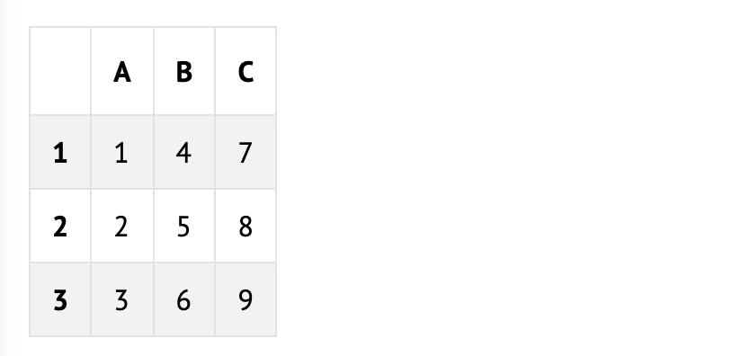

# 🎨 `art.frame`

## Problem to Solve

You’ve learned about data frames: objects for storing data in rows and columns. In a file called `art.R` in a folder called `art.frame`, practice using data frames to create your very own art in R.

## Background

You’ve learned how to create a data frame by reading data from a file. Turns out you can also create your own data frames from scratch, using a function called `data.frame`.

Per its documentation, data.frame can be provided any number of named arguments. Those argument names become the data frame’s column names. Then, the values for each of those arguments become the given column’s values.

Take a look at how you could create a small, 3x3 data frame:

```R
data.frame(
  A = c("1", "2", "3"),
  B = c("4", "5", "6"),
  C = c("7", "8", "9")
)
```

Notice that there are 3 named arguments: A, B, and C. Each is passed a different value—a vector of 3 numbers!

The above code produces a data frame like the below:

<p align="center">
	
</p>

Consider both widening and lengthening your data frame, as well as filling each column with a vector of empty spaces:

```R
data.frame(
  A = c(" ", " ", " ", " ", " "),
  B = c(" ", " ", " ", " ", " "),
  C = c(" ", " ", " ", " ", " "),
  D = c(" ", " ", " ", " ", " "),
  E = c(" ", " ", " ", " ", " ")
)
```
You now have a blank canvas with which to create your art!

## Distribution Code

For this problem, you’ll need to create `art.R` in a folder called` art.frame`.

Open RStudio per the linked steps and navigate to the R console:

```R
>
```

Next execute

```R
getwd()
```

to print your working directory. Ensure your current working directory is where you’d like to create this problem’s folder. If using RStudio through `cs50.dev` the recommended directory is `/workspaces/NUMBER` where `NUMBER` is a number unique to your codespace.

If you do not see the right working directory, use setwd to change it! Try typing `setwd("..")` if in the working directory of another problem, which will move you one directory higher.

Next execute

```R
dir.create("art.frame")
```

in order to create a folder called art.frame in your codespace.

Now type

```R
setwd("art.frame")
```

followed by Enter to move yourself into (i.e., open) that directory. Your working directory should now end with

```R
art.frame/
```

Finally, type

```R
file.create("art.R")
```

to create a file called `art.R` inside of the `art.frame` folder.

If all was successful, you should execute

```R
list.files()
```

and see `art.R`. If not, retrace your steps and see if you can determine where you went wrong!

To start on this problem, copy and paste the below code into `art.R`:

```R
art <- data.frame(
  A = c(" ", " ", " ", " ", " "),
  B = c(" ", " ", " ", " ", " "),
  C = c(" ", " ", " ", " ", " "),
  D = c(" ", " ", " ", " ", " "),
  E = c(" ", " ", " ", " ", " ")
)

print(art)
```

## Usage

Assuming `art.R` is in your working directory, enter the below in the R console to test your program:

```R
source("art.R")
```
