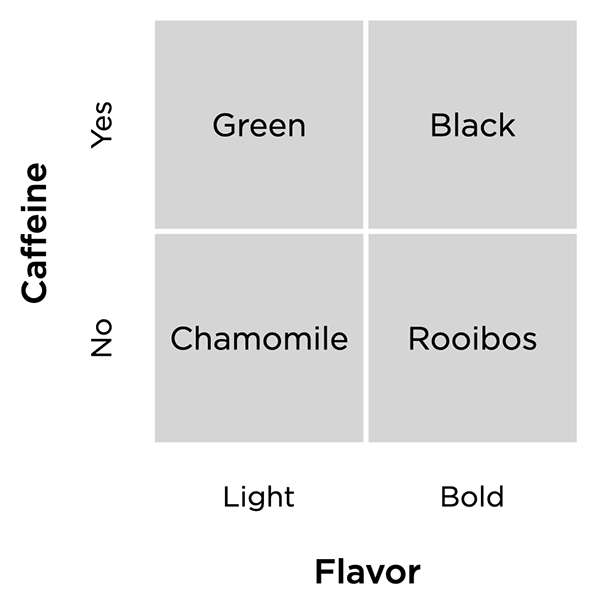

# 🍵 Teahouse

## Problem to Solve

Tea is the most popular drink in the world—after, of course, water!

In a program called `teahouse.R`, in a folder called `teahouse`, write a program to recommend users a cup of tea that will be… well, their cup of tea.

## Getting Started

For this problem, you’ll need to create `teahouse.R` in a folder called `teahouse`.

```R
dir.create("teahouse")
setwd("teahouse")
file.create("teahouse.R")
```

## Specification

This problem is composed of two parts. In the first part, you’ll write `teahouse.R`. In the second, you’ll write a program of your choice.

### Part 1: `teahouse.R`

<p align="center">
    
</p>

Tea varies along many dimensions. Consider two for the sake of this problem: **flavor** and **caffeine**.

In `teahouse.R`, write a program that prompts a user twice: first for their taste in flavor, and second for their preference for caffeine. Then, recommend teas based on the following logic:

- Recommend **green tea** if a user prefers caffeine and a light flavor.
- Recommend **black tea** if a user prefers caffeine and a bold flavor.
- Recommend **chamomile tea** if a user prefers no caffeine and a light flavor.
- Recommend **rooibos tea** if a user prefers no caffeine and a bold flavor.

A user should enter either “Light” or “Bold” for their taste in flavor and “Yes” or “No” for their preference for caffeine. If a user does not enter a valid choice for either one, do not recommend a tea: instead, remind them of the proper inputs.

### Part 2: Setting Up Shop

Think about a beverage you particularly enjoy (or perhaps a type of food!). In the same folder as `teahouse.R`, write a program to recommend various types of that beverage or food based on input from the user. Be as creative as you’d like: the only requirement is that you’re excited about your choice!

## How to Test

Here’s how to test your code from Part 1 manually:

- Run your program with `source("teahouse.R")`. Type “Light,” followed by “Yes.” Your program should output a phrase to recommend “green tea.”
- Run your program with `source("teahouse.R")`. Type “Bold,” followed by “Yes.” Your program should output a phrase to recommend “black tea.”
- Run your program with `source("teahouse.R")`. Type “Light,” followed by “No.” Your program should output a phrase to recommend “chamomile tea.”
- Run your program with `source("teahouse.R")`. Type “Bold,” followed by “No.” Your program should output a phrase to recommend “rooibos tea.”
- Run your program with `source("teahouse.R")`. Type “Medium,” followed by “Yes.” Your program should remind the user of the options for flavor.
- Run your program with `source("teahouse.R")`. Type “Light,” followed by “Maybe.” Your program should remind the user of the options for caffeine.

Test your code from Part 2 in a similar way, with inputs that make sense for your program.
