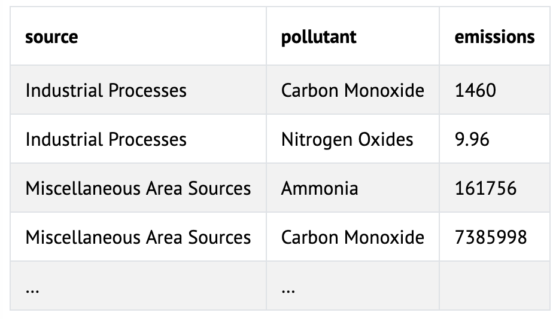

# 💨 Northwest Air

## Problem to Solve

Time to head west! The United States’s “Pacific Northwest” is a northwest region including the states of Oregon, Washington, and Northern Idaho. The region’s cooler temperatures and cloudy skies attract athletes and outdoor adventurers of all kinds. Recently, though, the increasing prevalence of wild fires has threatened the region’s once pristine air quality.

In this problem, in a file called `air.R` in a folder called `air`, you’ll learn about indicators of air quality and use R to analyze common air pollutants in the state of Oregon.

## Distribution Code

```R
download.file("https://cdn.cs50.net/r/2024/x/psets/4/air.zip", "air.zip")
```

## Schema

Before jumping in, it will be helpful to get a sense for the “schema” (i.e., organization!) of the data you’re given.

In `air.csv`, you’ll find data from the United States Environmental Protection Agency’s National Emissions Inventory. This inventory tracks all emissions of certain pollutants (i.e., harmful substances released into the air).

Some pollutants are called “criteria air pollutants” (CAPs) by the United States Environmental Protection Agency (EPA). These pollutants are more harmful than others. According to the EPA:

> Criteria air pollutants are found all over the U.S. They can harm your health and the environment, and cause property damage.

Ozone, carbon monoxide, lead, and nitrogen dioxide are all examples of criteria air pollutants.

`air.csv` shows the amount of criteria air pollutants emitted in Oregon. The data is very detailed! For each county (i.e., municipality), you can see how much of each pollutant is emitted by different sources, like school buses or wildfires.

Pay attention to these columns:

- `State-County`, which is the county in which the emission took place
- `POLLUTANT`, which is the pollutant being emitted
- `Emissions (Tons)`, which is the amount of the pollutant emitted (in tons)
- `SCC Levels 1–4`, which describes the source of the pollutant, from more general (Level 1) to more specific (Level 4)

## Specification

### `1.R`

In `1.R`, read `air.csv` into a tibble called `air`, renaming and selecting the columns you need. In particular, ensure the `air` tibble includes only the following columns:

- `state`, renamed from State
- `county`, renamed from State-County
- `pollutant`, renamed from POLLUTANT
- `emissions`, renamed from Emissions (Tons)
- `level_1`, renamed from SCC LEVEL 1
- `level_2`, renamed from SCC LEVEL 2
- `level_3`, renamed from SCC LEVEL 3
- `level_4`, renamed from SCC LEVEL 4

Save the resulting `air` tibble, using `save`, in a file called `air.RData`. You’ll use this tibble in the remaining `.R` files.

### `2.R`

To sustainably improve air quality, analysts often focus their efforts on particular sources of pollutants. To identify which sources might need the most attention, find the largest sources of pollutants in Oregon.

In `2.R`, load the `air` tibble from `air.RData` with `load`. Update the tibble by sorting all rows by the `emissions` column, highest value to lowest.

Save the resulting `air` tibble, using `save`, in a file called `2.RData`.

### `3.R`

In addition to focusing on the largest sources of pollutants, analysts might focus on particular geographic regions. Choose one of the counties in Oregon from this list. Find all sources of pollutants in that county.

In `3.R`, load the air tibble from `air.RData` with `load`. Transform the tibble so that it only includes data for the `county` of your choice.

Save the resulting `air` tibble, using `save`, in a file called `3.RData`.

### `4.R`

Combine your analyses from `2.R` and `3.R`.

In `4.R`, load the air tibble from `air.RData` with `load`. Transform the tibble so that it only includes data for the `county` of your choice and sorts the data by the `emissions` column, highest value to lowest.

Save the resulting `air` tibble, using `save`, in a file called `4.RData`.

### `5.R`

So far, you’ve identified the largest sources of pollutants across the entire state of Oregon, as well as within a single county. Now, find the single largest pollutant source for each county.

In `5.R`, load the air tibble from `air.RData` with `load`. Transform the tibble so that it includes the single row with the highest value in the `emissions` column for each `county`.

Save the resulting `air` tibble, using `save`, in a file called `5.RData`.

### `6.R`

Some pollutants tend to be emitted at higher rates than others. For each pollutant, find its total emissions across the entire state of Oregon.

In `6.R`, load the air tibble from `air.RData` with `load`. Summarize the data in the tibble to find the total emissions for each pollutant. Sort the pollutants from highest to lowest emissions.

The resulting tibble should have two columns, one called `pollutant` and one called `emissions`.

Save the resulting `air` tibble, using `save`, in a file called `6.RData`.

### 7.R

In professional air quality reports, analysts will often calculate total emissions for broad categories of sources. In fact, the `level_1` column in the air tibble lists the broad category in which a specific source is included! For each category of source in `level_1`, calculate the total emissions of each pollutant.
Want to learn more about these categories?

Among these broad categories are:

- **Industrial Processes**, which includes activities such as chemical manufacturing, metal processing, and food production
- **Miscellaneous Area Sources**, which includes small-scale activities like residential heating, lawn mowing, and commercial cooking
- **Mobile Sources**, which includes vehicles such as cars, trucks, airplanes, and ships
- Natural Sources, which includes wildfires, volcanic activity, and biogenic emissions from plants and trees
- **Solvent Utilization**, which includes the use of products like paints, coatings, and cleaning agents
- **Stationary Source Fuel Combustion**, which includes the burning of fuels in fixed locations, such as power plants, industrial boilers, and residential heating
- **Storage and Transport**, which includes the handling and movement of fuels and chemicals, leading to evaporative emissions
- **Waste Disposal, Treatment, and Recovery**, which includes landfills, waste treatment facilities, and recycling operations

In `7.R`, load the `air` tibble from `air.RData` with load. Transform the tibble to find the total emissions of each pollutant from each of the `level_1` source categories. Sort the rows first alphabetically by source name, then alphabetically by pollutant name.

The resulting tibble should have three columns, one called `source`, one called `pollutant`, and one called `emissions`.

<p align="center">
	
</p>


## Advice

There are a few ways to approach these problems! Consider the below as advice to help you on your way:

### Use `read_csv` to read data directly into a tibble

Turns out the `tidyverse` has a function you can use in place of `read.csv`! After loading the `tidyverse`, try using `read_csv` to load a CSV file directly into a tibble.

### Use `summarize` to summarize data

In lecture, you saw that summarize can calculate the number of rows in a group, using the function `n`. You can use other functions with `summarize` too, such as `sum`:

```R
summarize(DATA, sum())
```

where `DATA` is a data frame.

In fact, you can pass an argument to sum if you’d like to summarize data by summing a particular column for each group in your data:

```R
summarize(DATA, sum(COLUMN))
```

where `COLUMN` is a column name in your data frame.


## How to Test

Here’s how to test your code manually:

1. Executing `1.R` should create a tibble named `air` with 32,015 rows and 8 columns
2. Executing `2.R` should create a tibble named `air` with 32,015 rows and 8 columns, sorted from highest to lowest value in the `emissions` column
3. Executing `3.R` should create a tibble named `air` with rows for a single county and 8 columns
4. Executing `4.R` should create a tibble named `air` like the one in `3.R`, but with rows sorted from highest to lowest value in the `emissions` column
5. Executing `5.R` should create a tibble named `air` with 36 rows and 8 columns, sorted from highest to lowest value in the `emissions` column
6. Executing `6.R` should create a tibble named `air` with 7 rows and 2 columns, sorted from highest to lowest value in the `emissions` column
7. Executing `7.R` should create a tibble named `air` with 39 rows and 3 columns, sorted first from highest to lowest value in the `emissions` column and then alphabetically by pollutant name
