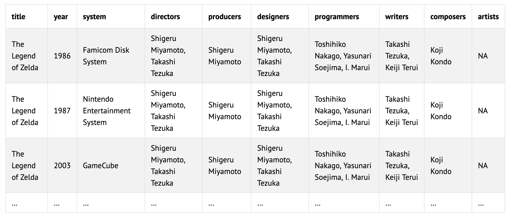

# 🧝🏽‍♂️ Zeruda no Densetsu

## Problem to Solve

You’ve just been hired as a game historian for Nintendo, the Japanese multinational video game company. Your first job is to organize an old data file that details the history of Zeruda no Densetsu (The Legend of Zelda), one of the company’s most popular game series.

In a file called `zelda.R`, in a folder called `zelda`, tidy up some data on the history of The Legend of Zelda and use it to answer questions about the series.

## Distribution Code

```R
download.file("https://cdn.cs50.net/r/2024/x/psets/4/zelda.zip", "zelda.zip")
```

## Schema

Before jumping in, it will be helpful to get a sense for the “schema” (i.e., organization!) of the data you’re given.

In `zelda.csv`, you are provided data on the history of The Legend of Zelda. In `zelda.csv`, there are 4 columns:

- `title`, which is the title of a game in The Legend of Zelda series
- `release`, which includes the year a game was released and the console for which it was released
- `role`, which describes a role in the development of a game
- `names`, which lists the names of those who held a given role in the development of a game

Needless to say, this data is not very tidy! It’s up to you to format it correctly and, once ready, answer questions about the history of the series.

## Specification

In this problem, you’ll use each of the included `.R` files to take one step in your analysis of the given data.

### `1.R`

In `1.R`, organize the data in `zelda.csv` to get it ready for analysis. Save the cleaned data as a tibble named `zelda` in `zelda.RData`.

Make sure the tibble follows these tidy data rules:

- Each row should be one release of a The Legend of Zelda game.
    - Keep in mind, a single game is often released multiple times on different systems.
- Each column should be one way a release can differ.
    - For example, releases can differ based on release year, system, or the people involved in making it.
- Each cell should be a single piece of information.

The first few rows of the tibble should look like the below. The tibble should include only the following columns. Capitalization of column names does matter!

<p align="center">
	
</p>

Notice how the tibble follows the principles of tidy data:

- Each row is a release.
- Each column is information about a release.
- Each cell is a single piece of information.

A list of names can count as “a single piece of information” for this problem’s purposes.

Save the resulting `zelda` tibble, using `save`, in a file named `zelda.RData`. You’ll use this tibble in the remaining `.R` files.

#### Hint

To tidy your data, consider whether any of the functions available in the [`stringr` library](https://stringr.tidyverse.org/reference/index.html) might be useful to you—even if it’s not one you saw in lecture!

### `2.R`

Your first assignment is to summarize the number of Zelda releases in each year.

In `2.R`, load the tidied `zelda` tibble from `zelda.RData` with `load`. Update the tibble by summarizing the number of releases in each year. Sort the rows by the number of releases in a given year, most to least.

The tibble should have two columns: `year`, `releases`

Save the resulting `zelda` tibble, using `save`, in a file named `2.RData`.

### `3.R`

Your next assignment is to identify the original (first) release for each Zelda title.

In `3.R`, load the tidied `zelda` tibble from `zelda.RData` with load. Update the tibble so that it includes only the first release(s) for each Zelda title. If a title had two different releases in its first year (perhaps for two different systems), include both.

Sort the releases by `year`, from oldest to newest. If any two releases have the same `year`, sort them alphabetically by `title`, followed by `system`.

Save the resulting `zelda` tibble, using `save`, in a file named `3.RData`.

### `4.R`

Your next assignment is to help commemorate the work of Shigeru Miyamoto, one of the original creators of the Zelda series.

In `4.R`, load the tidied `zelda` tibble from `zelda.RData` with `load`. Update the tibble so that that it includes only the original releases for all titles on which Shigeru Miyamoto was a producer. If any title had two different releases in its first year (perhaps for two different systems), include both.

Sort the releases by `year`, from oldest to newest. If any two releases have the same `year`, sort them alphabetically by `title`, followed by `system`.

Save the resulting `zelda` tibble, using `save`, in a file named `4.RData`.

### `5.R`

As Nintendo expands its leadership team, your final assignment is to identify the original releases for all titles with more than 1 producer.

In `5.R`, load the tidied `zelda` tibble from `zelda.RData` with `load`. Update the tibble to include only the first release(s) for each title with more than 1 producer. If such a title had two different releases in its first year (perhaps for two different systems), include both.

Sort the releases by `year`, from oldest to newest. If any two releases have the same `year`, sort them alphabetically by `title`, followed by system.

Save the resulting `zelda` tibble, using `save`, in a file named `5.RData`.

## How to Test

Here’s how to test your code manually:

1. Executing `1.R` should create a tibble named `zelda` with 71 rows and 10 columns
2. Executing `2.R` should create a tibble named `zelda` with 27 rows and 2 columns
3. Executing `3.R` should create a tibble named `zelda` with 22 rows for 10 columns
4. Executing `4.R` should create a tibble named `zelda` with 10 rows and 10 columns
5. Executing `5.R` should create a tibble named `zelda` with 3 rows and 10 columns
