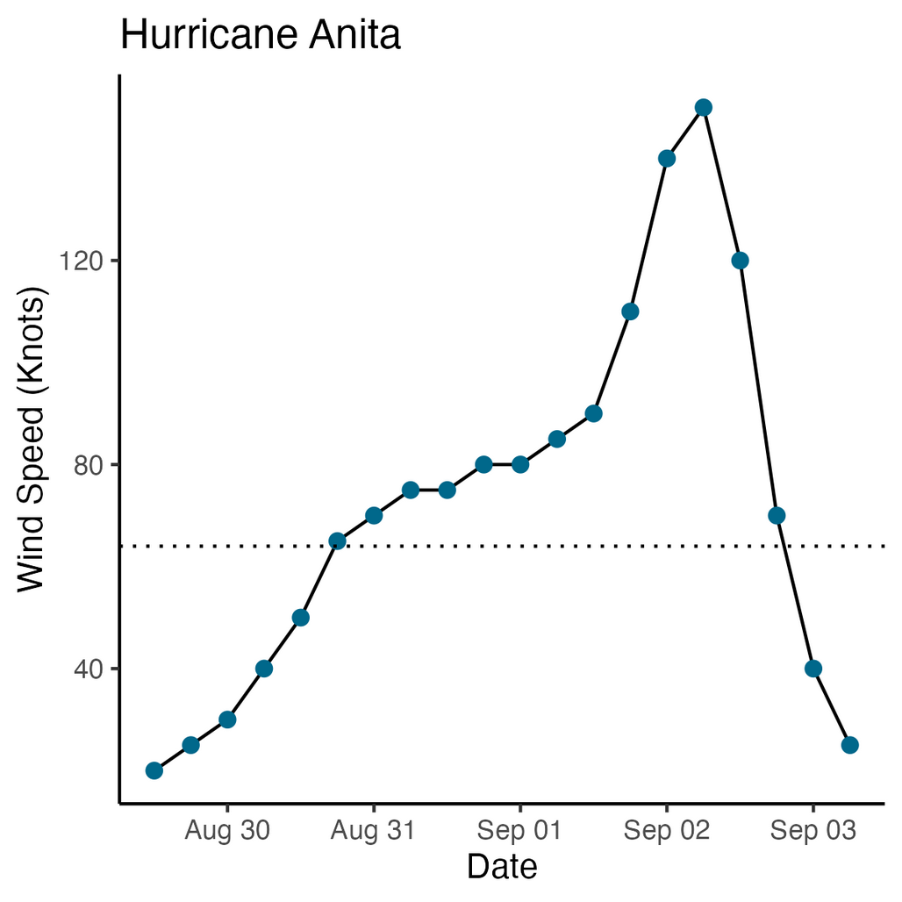

# 🔍 Exploratory Data Analysis

    

## Problem to Solve

Exploratory data analysis (EDA) is a method used by data scientists to find interesting characteristics of data and test hypotheses. It’s often one of the initial steps a researcher might take in a larger data analysis program.

You now have many of the tools you need to perform your own exploratory data analysis! In a program called `eda.R`, in a folder called `eda`, write a program to visualize and explore a data set of your choice.

## Specification

The only requirement for this problem is that you produce a visualization you care about, that is interesting to you, and that you feel proud of. Oh, and that you save the visualization in a file called `visualization.png`!

You might find it helpful to get a bit of inspiration:

- [How the BBC Visual and Data Journalism team works with graphics in R](https://medium.com/bbc-visual-and-data-journalism/how-the-bbc-visual-and-data-journalism-team-works-with-graphics-in-r-ed0b35693535)
- [The R Graph Gallery](https://r-graph-gallery.com/)
