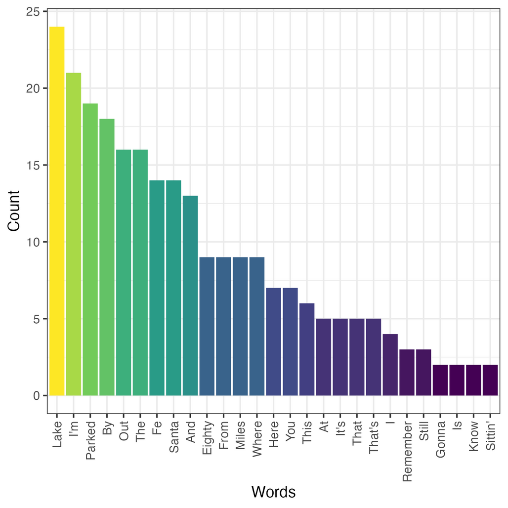

# 🏖️ Parked Out By The Lake

## Problem to Solve

In case you’re wondering, Dean Summerwind is parked out by the lake, 80 miles from Santa Fe. “Parked Out By The Lake” might sound like a normal song if you aren’t paying attention. But it became “the country song you need to hear” for what you’ll notice if you listen closely.

With a visualization, you might notice that—unsurprisingly—the most frequently used word is “Lake,” followed closely by “I’m,” “Parked,” “By,” “Out,” and “The.”

<p align="center">
	
</p>

Visualizing the frequency of words in song lyrics can help you get a sense for a song’s structure (and be just plain fun!). In `parked.R`, in a folder called `parked`, write a program to visualize the frequency of words in song lyrics of your choice.

## Distribution code

For this problem, you’ll need to download parked.R files and several text files of lyrics.

```r
download.file("https://cdn.cs50.net/r/2024/x/psets/5/parked.zip", "parked.zip")
```

## Specification

In parked.R, write a program to read a `.txt` file of your choice in the `lyrics` folder. Don’t like those songs? Create your own lyrics file! Sites like [genius.com](https://genius.com/) provide lyrics to most popular songs.

Consider writing your program in 3 steps:

1. Open and clean a lyrics file of your choice, splitting the file into a vector of individual words.
2. Convert the vector of words into a data frame that includes each word and the number of times it appears.
3. Visualize the data frame using the `ggplot2` package.

Ready? Let’s get started.

## Reading and Cleaning Lyric Files

Your program should read a lyrics file of your choice from the `lyrics` folder. To read a `.txt` file, consider using the [`read_file`](https://readr.tidyverse.org/reference/read_file.html) function in the `readr` package, part of the `tidyverse`.

Your lyrics file will likely need to be cleaned. Consider how you could use functions from the [`stringr`](https://stringr.tidyverse.org/reference/index.html) package to clean up your data. As much as possible, try to eliminate stylistic inconsistencies between words that are otherwise the same—such as capitalization or the presence of punctuation.

Finally, split your lyric file into a vector of individual words. Here too, consider what the [`stringr`](https://stringr.tidyverse.org/reference/index.html) package might offer.

## Summarizing Lyrics

With a vector individual words, consider transforming your vector into a data frame of two columns: `word`, `count`

The `word` column could, for instance, contain the unique words present in your lyrics while `count` includes the count of each of those lyrics.

## Vizualising Lyrics

With a data frame of words and their frequency, use the [`ggplot`](https://ggplot2.tidyverse.org/reference/ggplot.html) function to plot the lyrics. Save your resulting plot as a file named `lyrics.png` using [`ggsave`](https://ggplot2.tidyverse.org/reference/ggsave.html).

## Advice

Consider this as advice to help you on your way!

### Filter out one-time lyrics

If you have too many words you’re plotting on the horizontal axis of your plot, your visualization might get too wide! Consider filtering out words that don’t appear more than once.

### Consider variations in capitalization and punctuation

Take a look at `robinson.txt`, which includes lyrics to Porter Robinson’s “Look at the Sky”. Notice that the word “sky” appears several times, but that it may have different punctuation surrounding it: for instance “sky,” (with a comma) and “sky” without a comma.

Also notice that, in some places, the word “something” is capitalized. In other places, it is not.

These variations are possible to remove! Take a look at what the [`stringr`](https://stringr.tidyverse.org/reference/index.html) package can offer.
